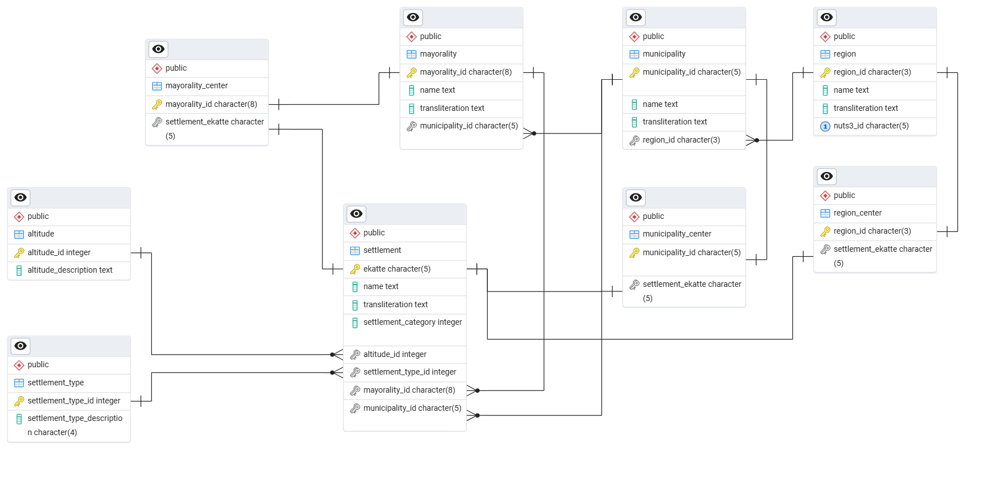

# EKATTE Project

Система за управление и търсене в официалния класификатор на административно-териториалните и териториалните единици (ЕКАТТЕ) на България.

## 🗄️ База данни & Архитектура

Схемата е проектирана в **трета нормална форма (3NF)**, гарантираща липса на излишък и интегритет на данните. Всички SQL ресурси са организирани в директория `pg_sql_scripts/`.

### Структура и Оптимизация:
- **ER Динамика:** Пълната логическа схема на базата данни може да бъде видяна тук:
  
- **SQL Скриптове:** В папка `pg_sql_scripts/` ще откриете:
  - Скриптове за създаване на таблици (`DDL`).
  - Дефиниции на **Views**, които капсулират сложните `JOIN` операции.
  - Индекси върху външни ключове и колони за търсене.
- **Интегритет:** Използват се строго типизирани данни и констрейнти, съобразени с [номенклатурата на НСИ](https://www.nsi.bg/nrnm/pages/nomenklatura).

## 📥 Импортиране на данни

Процесът е автоматизиран чрез Node.js CLI инструмент, намиращ се в папка `import`.

- **Транзакции:** Всички записи се извършват в транзакции. При грешка се задейства автоматичен **rollback**.
- **Batch Processing:** Използва се `batchInsert` с динамично параметризирани заявки за висока производителност при големи обеми от Excel/JSON файлове.
- **Нормализация:** Автоматично изчистване на невалидни ID-та и форматиране на кодовете на кметствата чрез `normalizeMayoralityId`.

## 🔍 search_ekatte (API & Frontend)

Проектът е разделен на две независими части за пълна изолация.

### Бекенд (Port 3000)
- **Custom Router:** Изграден без външни фреймуъркове, използващ чист Node.js `http` модул.
- **Pagination:** Реализирана на ниво база данни чрез `LIMIT` и `OFFSET`, което позволява бърза работа дори при хиляди записи.
- **CORS:** Ръчно конфигуриран за сигурна комуникация с фронтенд сървъра.
- **Exports:** Поддръжка на експорт към **CSV** и **Excel** директно от резултатите от търсенето.

### Фронтенд (Port 8000)
- **Debounced Search:** Оптимизирани AJAX заявки, които се изпращат само след като потребителят спре да пише (300ms delay).
- **Dynamic UI:** Рендериране на резултатите в реално време и актуализация на броя намерени записи без презареждане на страницата.

## 🛠 Технологичен стек (Dependencies)

Проектът използва подбран набор от библиотеки:

### ⚙️ Основна инфраструктура
* **`pg`**: PostgreSQL клиент за Node.js. Използва се за управление на връзките (pooling), изпълнение на SQL заявки и транзакции.
* **`dotenv`**: Зарежда конфигурационни променливи от `.env` файл. Гарантира сигурността на чувствителни данни като пароли за БД.
* **`mime-types`**: Използва се за правилно определяне на файлови формати при динамично генериране на отговори от сървъра (CSV, Excel).

### 📊 Обработка на данни и архивиране
* **`exceljs`**: Използва се за четене на входните данни от НСИ и генериране на детайлни Excel репорти при експорт.
* **`jszip`**: Позволява обработка на компресирани архиви в реално време (напр. при сваляне на текстови ресурси).

### 🧪 Тестване и качество на кода
* **`vitest`**: Модерна тестова среда, използвана за Unit и интеграционни тестове.
* **`@vitest/coverage-v8`**: Генерира детайлни репорти за тестов покрив (Code Coverage), за да се гарантира надеждността на логиката.
* **`jsdom`**: Симулира браузърна среда за тестване на DOM манипулациите във фронтенда без нужда от реален браузър.

### 📚 Документация
* **`jsdoc`**: Инструмент за автоматично генериране на техническа документация директно от коментарите в кода.
* **`docdash`**: Тема за JSDoc, която предоставя йерархично меню и търсачка за по-лесна навигация в документацията.

## 📖 Документация & Тестове

### Автоматична документация
Проектът използва **JSDoc** с шаблона **Docdash**. Документацията за `search_ekatte/src` е налична директно в текущия бранч.
- [Full API Reference](./docs/index.html) *(Отворете локално през браузъра)*

### Тестване
Използва се **Vitest** за гарантиране качеството на кода:
- **Unit Tests:** Покриват валидациите и помощните функции.
- **Controller Tests:** Тестват мапинга на заявките и логиката на отговорите.

#### Изпълнение на тестовете:
```bash
# Стартиране на всички тестове
npm test

# Стартиране на тестове и генериране на Coverage репорт
npm run coverage
